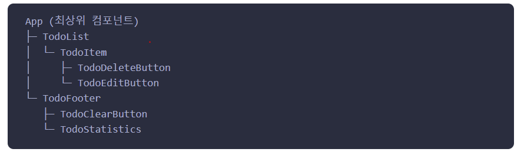

# 애플리케이션 생성


## 1. 애플리케이션 생성

- Vue를 사용하기 위해

1. CDN 사용법
   - `<script src="https://unpkg.com/vue@next"></script>`
   - 다음 코드를 통해 불러온다.
     - `const createApp = Vue.createApp'`
   - 구조 분해 할당(위 코드와 동일)
     - `const { createApp } = Vue`

2. 빌드 툴(Vite)를 통해 설치해서 사용할 경우

   `$ npm init vue@latest`

   ```
   $ cd <your-project-name>
   $ npm install
   $ npm run dev
   ```

   `const { createApp } from 'vue'`

- 처음 어플리케이션을 시작할 때, createApp 함수를 사용해서 어플리케이션 인스턴스를 만들어 준다.

  - `const app = Vue.createApp({})`
  - `  const app = createApp({})`
  
  


## 2. 최상위(Root) 컴포넌트

- createApp에 전달하는 객체는 컴포넌트이다.
- 모든 어플리케이션은 다른 컴포넌트들을 자식으로 포함할 수 있는 최상위 컴포넌트가 필요하다.
- 예를 들어, 컴포넌트들은 다음과 같은 구조를 가질 수 있다.



- 싱글 파일 컴포넌트를 사용하는 경우, 일반적으로 다른 파일에서 루트 컴포넌트를 가져온다.

```js
import { createApp } from 'vue'
// 싱글 파일 컴포넌트에서 최상위 컴포넌트 앱을 가져온다.
import App from './App.vue'

const app = createApp(App)
```


## 3. 앱 마운트

- 인스턴스를 생성 후, mount() 메서드를 이용해서 DOM 요소와 Vue 어플리케이션을 마운트하자.

- 마운트 될 DOM 요소 또는 셀렉터 문자열을 컨테이너라고 한다.

  ```html
    <div id="app">
      {{ message }}
    </div>
  ```

  ```js
  app.mount('#app')
  ```


### DOM 내부의 최상위 컴포넌트 템플릿

- 이 부분은 무슨 말인지 잘 모르겠다.